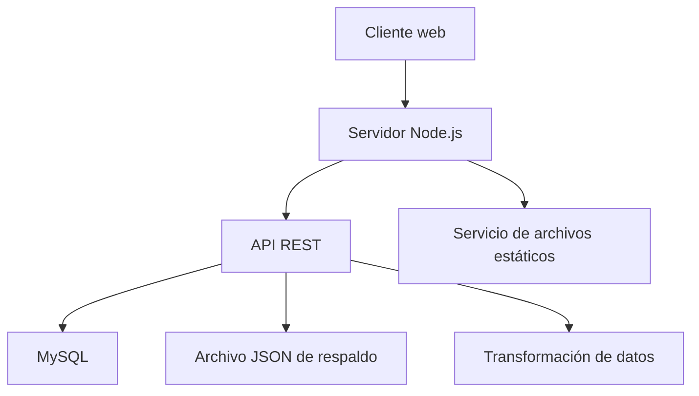
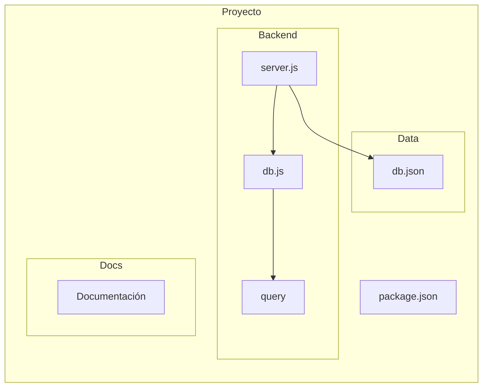

# PIAR - Documento 02: Arquitectura

## 1. Propósito del documento

Este documento describe la arquitectura del proyecto PIAR a partir de la implementación real encontrada en el repositorio. La información se deriva exclusivamente de los archivos [backend/server.js](backend/server.js), [backend/db.js](backend/db.js), [data/db.json](data/db.json) y [package.json](package.json).

---

## 2. Arquitectura general

El proyecto actual presenta una arquitectura sencilla, basada en un servidor HTTP local desarrollado en Node.js. Su función principal es servir recursos estáticos y exponer una API ligera para gestionar información relacionada con estudiantes y datos de apoyo.

### Características generales
- El servidor corre sobre Node.js y usa el módulo `http` nativo.
- El backend atiende solicitudes web y API desde un mismo punto de entrada.
- El proyecto combina una capa de servicio web con acceso a una base de datos MySQL.
- Además, mantiene un archivo JSON como respaldo o fuente de datos de prueba.

### Resumen funcional
- El servidor recibe peticiones HTTP.
- Si la ruta corresponde a `/api`, la procesa como una solicitud de API.
- Si no, intenta servir un archivo estático desde la raíz del proyecto.
- El backend puede consultar estudiantes desde MySQL y transformar los datos antes de enviarlos.

---

## 3. Arquitectura por capas

### Capa de presentación
- Responsabilidad: entregar recursos del sistema al navegador y recibir solicitudes HTTP.
- Archivos pertenecientes:
  - [backend/server.js](backend/server.js)
  - [README.md](README.md)
- Flujo de información:
  1. El cliente hace una solicitud al servidor.
  2. El servidor decide si la ruta corresponde a una API o a un recurso estático.
  3. Si es estático, lo envía al navegador.
- Dependencias:
  - Usa módulos nativos de Node.js como `http`, `fs/promises`, `path` y `vm`.

### Capa de negocio
- Responsabilidad: transformar y adaptar los datos para que puedan ser consumidos por el frontend y por la lógica del sistema.
- Archivos pertenecientes:
  - [backend/server.js](backend/server.js)
- Flujo de información:
  1. El servidor recibe un payload desde la solicitud.
  2. Ejecuta funciones de normalización y adaptación.
  3. Envía la información ya preparada a la capa de acceso a datos o al cliente.
- Dependencias:
  - Depende de la capa de acceso a datos para persistir o consultar información.

### Capa de acceso a datos
- Responsabilidad: interactuar con MySQL y, en algunos casos, con el archivo JSON de respaldo.
- Archivos pertenecientes:
  - [backend/db.js](backend/db.js)
  - [backend/server.js](backend/server.js)
  - [data/db.json](data/db.json)
- Flujo de información:
  1. El servidor crea una conexión con MySQL.
  2. Ejecuta consultas SQL para obtener o modificar estudiantes.
  3. Opcionalmente usa el archivo JSON como fuente temporal o de respaldo.
- Dependencias:
  - Usa la librería `mysql2` para conectar y consultar la base de datos.

---

## 4. Diagrama de componentes

### Explicación técnica
- El cliente web realiza peticiones al servidor HTTP.
- El servidor distingue entre rutas de API y archivos estáticos.
- La API consulta MySQL para operaciones sobre estudiantes.
- La capa de transformación adapta los registros del modelo actual al contrato esperado por el frontend.
- El archivo JSON se usa como respaldo o como fuente de datos inicial.

---

## 5. Diagrama de paquetes

### Explicación técnica
- El paquete principal del proyecto está definido en [package.json](package.json).
- El backend está contenido en [backend/server.js](backend/server.js) y [backend/db.js](backend/db.js).
- El archivo [backend/query](backend/query) indica la configuración de MySQL usada en el entorno.
- El directorio [data](data) contiene datos de ejemplo o respaldo.
- El directorio [docs](docs) aloja la documentación técnica.

---

## 6. Diagrama de clases

No aplica de forma explícita en la implementación actual. El proyecto no define clases en JavaScript orientado a objetos ni módulos con estructura de clases. La lógica está organizada principalmente en funciones y procedimientos dentro del archivo [backend/server.js](backend/server.js).

### Justificación
- El servidor usa funciones independientes para manejar rutas, normalizar datos, transformar estudiantes y enviar respuestas JSON.
- No existe una jerarquía de clases ni instancias de clases definidas en el código.

---

## 7. Flujo de información general

### Flujo 1: Solicitud de página estática
1. El navegador solicita una ruta como `/` o `/index.html`.
2. El servidor resuelve la ubicación real en el sistema.
3. Si el archivo existe, lo entrega con el tipo MIME correspondiente.

### Flujo 2: Solicitud a la API de salud
1. El cliente solicita `GET /api/health`.
2. El servidor devuelve un mensaje JSON de verificación.

### Flujo 3: Consulta de estudiantes
1. El cliente solicita `GET /api/estudiantes`.
2. El backend consulta MySQL.
3. Los registros pasan por `mapStudentRowToFrontend()`.
4. Se envía una respuesta JSON adaptada al frontend.

### Flujo 4: Creación y actualización de estudiantes
1. El cliente envía un payload al endpoint correspondiente.
2. El servidor normaliza el payload con `normalizeStudentPayload()`.
3. Se ejecuta una sentencia SQL para insertar o actualizar en MySQL.
4. Se responde con el estudiante transformado.

---

## 8. Observaciones de arquitectura

### Puntos fuertes
- La arquitectura es simple y fácil de entender.
- El backend concentra la lógica de rutas y procesamiento en un solo archivo.
- La separación entre servidor, conexión a base de datos y datos base es clara enough para un proyecto pequeño.

### Limitaciones observadas
- No existe una separación formal entre controladores, servicios y repositorios.
- La lógica de negocio y la lógica de rutas están mezcladas en [backend/server.js](backend/server.js).
- La arquitectura es funcional, pero no está diseñada para escalar con múltiples módulos o equipos.

---

## 9. Conclusión

La arquitectura actual del proyecto PIAR es una arquitectura sencilla de tipo cliente-servidor, con un backend HTTP en Node.js, una capa de negocio enfocada en la transformación de datos, y una capa de acceso a datos basada en MySQL. La estructura es mínima, pero suficiente para cumplir con las funcionalidades implementadas en el código actual.
