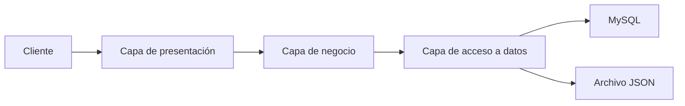

# PIAR - Documento 03: Capas de la aplicación

## 1. Propósito del documento

Este documento identifica las capas que pueden observarse en la implementación actual del proyecto PIAR. La información se basa exclusivamente en el código real disponible en [backend/server.js](backend/server.js), [backend/db.js](backend/db.js), [data/db.json](data/db.json) y [package.json](package.json).

---

## 2. Capa de presentación

### Responsabilidad
La capa de presentación es la encargada de recibir las solicitudes del cliente y entregar la respuesta correspondiente. En el proyecto actual esta responsabilidad está concentrada en el servidor HTTP.

### Archivos que pertenecen
- [backend/server.js](backend/server.js)
- [README.md](README.md)

### Flujo de información
1. El cliente realiza una petición a una ruta específica.
2. El servidor evalúa si la ruta corresponde a una API o a un recurso estático.
3. Si es un recurso estático, lo entrega al navegador.
4. Si es una ruta `/api`, la procesa y devuelve un JSON.

### Dependencias
- Usa módulos nativos de Node.js: `http`, `fs/promises`, `path` y `vm`.
- No depende de un framework de interfaz como React, Vue o Angular.

### Observación técnica
La capa de presentación y la capa de negocio están muy cercanas en este proyecto, porque la lógica de rutas, transformación de datos y respuestas JSON se concentra en el mismo archivo.

---

## 3. Capa de negocio

### Responsabilidad
La capa de negocio adapta y transforma la información para que sea útil tanto para el frontend como para la persistencia actual en MySQL.

### Archivos que pertenecen
- [backend/server.js](backend/server.js)

### Funciones presentes que pertenecen a esta capa
- `getStudentsFromMysql(callback)`
- `mapStudentRowToFrontend(row)`
- `normalizeStudentPayload(payload)`
- `splitStudentName(nombre)`
- `readDbFromMysql()`

### Flujo de información
1. Se recibe un payload o una consulta desde el cliente.
2. La lógica de negocio normaliza o transforma los datos.
3. Se entrega a la capa de acceso a datos o a la respuesta HTTP.

### Dependencias
- Depende de la conexión a MySQL para consultar o modificar estudiantes.
- Usa datos definidos en [data/db.json](data/db.json) para restaurar información de respaldo.

### Observación técnica
La transformación es necesaria porque el esquema actual de MySQL contiene campos más básicos que los que espera el frontend.

---

## 4. Capa de acceso a datos

### Responsabilidad
La capa de acceso a datos se encarga de interactuar con la base de datos MySQL y de manejar la persistencia de respaldo mediante un archivo JSON.

### Archivos que pertenecen
- [backend/db.js](backend/db.js)
- [backend/server.js](backend/server.js)
- [data/db.json](data/db.json)

### Funciones presentes que pertenecen a esta capa
- `readDb()`
- `writeDb(data)`
- `readSeedData()`
- `db.query(...)` en las rutas de estudiantes

### Flujo de información
1. El servidor se conecta a MySQL con `mysql2`.
2. Ejecuta consultas SQL como `SELECT`, `INSERT`, `UPDATE` y `DELETE` sobre la tabla `estudiante`.
3. En algunos casos utiliza el archivo JSON como respaldo o como fuente de datos inicial.

### Dependencias
- Requiere la librería `mysql2` declarada en [package.json](package.json).
- Depende de la configuración de conexión definida en [backend/db.js](backend/db.js).

### Observación técnica
Aunque el proyecto tiene un archivo JSON, la persistencia principal para estudiantes está implementada sobre MySQL.

---

## 5. Relación entre capas

La arquitectura actual del proyecto se puede resumir así:

### Explicación
- El cliente inicia una petición.
- La capa de presentación recibe y canaliza la solicitud.
- La capa de negocio adapta los datos.
- La capa de acceso a datos realiza la lectura o escritura real.

---

## 6. Dependencias entre archivos

| Módulo | Depende de | Tipo de dependencia |
|---|---|---|
| [backend/server.js](backend/server.js) | [backend/db.js](backend/db.js) | Conexión a MySQL |
| [backend/server.js](backend/server.js) | [data/db.json](data/db.json) | Lectura y escritura de respaldo |
| [backend/server.js](backend/server.js) | [package.json](package.json) | Dependencia de ejecución |
| [backend/db.js](backend/db.js) | [package.json](package.json) | Uso de `mysql2` |

---

## 7. Conclusión

El proyecto actual mantiene una estructura muy simple con tres capas que se entrelazan en el mismo servidor. La capa de presentación atiende solicitudes, la capa de negocio adapta los datos, y la capa de acceso a datos interactúa con MySQL y con un archivo JSON de respaldo. No existe una separación formal en módulos independientes, pero sí es posible identificar claramente estas responsabilidades en el código real.
