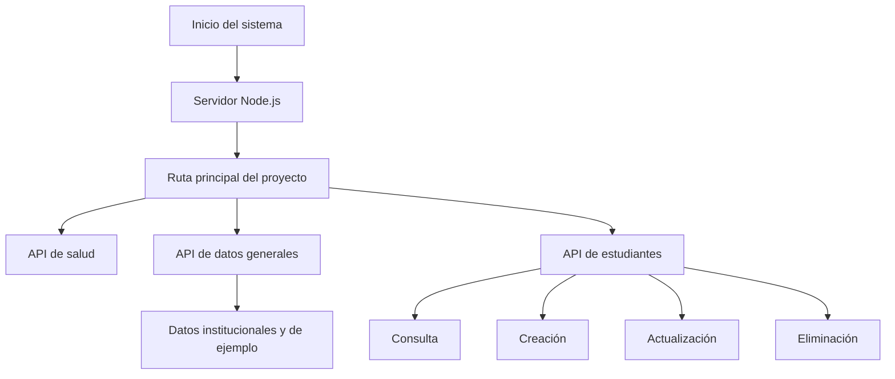
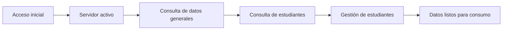

# PIAR - Documento 11: Mapa de navegación

## 1. Propósito del documento

Este documento presenta el mapa de navegación del sistema PIAR con base en lo que puede comprobarse en el código y en los datos del proyecto. La información se limita a lo que está implementado o evidenciado en [README.md](README.md), [backend/server.js](backend/server.js), [data/db.json](data/db.json) y [docs](docs).

---

## 2. Alcance del mapa de navegación

El proyecto actual no expone un sistema de navegación completo de pantallas como en una SPA tradicional con rutas visuales. Lo que sí está implementado es un flujo de acceso a recursos y servicios a través de un servidor local, con endpoints HTTP y datos de ejemplo cargados desde un archivo JSON.

Por esta razón, el mapa de navegación se presenta en términos de:
- acceso inicial al sistema,
- consumo de datos por parte del backend,
- y rutas de servicio expuestas al cliente.

---

## 3. Flujo general del sistema



### Explicación del flujo
1. El sistema inicia con el servidor Node.js.
2. El usuario accede a la ruta principal del proyecto.
3. El backend responde con recursos estáticos o con datos a través de la API.
4. La API expone servicios relacionados con salud, datos generales y estudiantes.

---

## 4. Flujo desde Login hasta Reportes

### Observación importante
No se encuentra en el código una implementación real de pantalla de Login ni de módulo de Reportes. El repositorio actual contiene backend y datos base, pero no evidencia una interfaz con pantallas completas ni rutas navegables del tipo Login → Menú → Reportes.

Por ello, el flujo se describe únicamente en el nivel de servicio y datos que está implementado.

### Flujo posible según lo que sí existe



### Explicación
- El acceso inicial depende del arranque del servidor.
- Luego el sistema puede servir datos generales y de estudiantes.
- Los registros pueden consultarse, crearse, actualizarse o eliminarse.
- La información queda preparada para consumo por una interfaz futura o por el frontend asociado.

---

## 5. Pantallas o módulos que se pueden identificar

### 5.1 Pantalla principal
- Objetivo: servir la aplicación o el recurso inicial del proyecto.
- Evidencia: [backend/server.js](backend/server.js) resuelve la ruta `/` a un recurso estático.
- Implementación real: servidor HTTP que entrega archivos desde la raíz del proyecto.

### 5.2 API de salud
- Objetivo: verificar que el servicio está activo.
- Evidencia: ruta `GET /api/health`.
- Implementación real: [backend/server.js](backend/server.js).

### 5.3 API de datos generales
- Objetivo: proporcionar datos de institución, autenticación y soporte de ejemplo.
- Evidencia: ruta `GET /api/data`.
- Implementación real: `readDbFromMysql()` en [backend/server.js](backend/server.js).

### 5.4 Gestión de estudiantes
- Objetivo: permitir consultar, crear, actualizar y eliminar estudiantes.
- Evidencia: rutas `GET`, `POST`, `PUT` y `DELETE` bajo `/api/estudiantes`.
- Implementación real: [backend/server.js](backend/server.js).

### 5.5 Datos base o respaldo
- Objetivo: mantener un conjunto de datos inicial para restauración.
- Evidencia: [data/db.json](data/db.json) y la ruta `POST /api/reset`.
- Implementación real: [backend/server.js](backend/server.js).

---

## 6. Archivos que implementan el flujo

| Flujo | Archivo |
|---|---|
| Inicio del servidor y ruteo | [backend/server.js](backend/server.js) |
| Conexión a MySQL | [backend/db.js](backend/db.js) |
| Datos base de ejemplo | [data/db.json](data/db.json) |
| Instrucciones de ejecución | [README.md](README.md) |

---

## 7. Limitaciones del mapa de navegación real

No se pueden documentar pantallas completas como:
- Login,
- Menú principal,
- Módulo de docentes,
- Módulo de observaciones,
- Módulo de reportes,
- o flujo de navegación visual,

porque el repositorio actual no contiene evidencia de esas interfaces implementadas de forma explícita.

### Conclusión técnica
El proyecto en su estado actual está más orientado a un backend de servicios que a una aplicación con navegación gráfica completa.

---

## 8. Mapa de navegación resumido

```text
Inicio del sistema
  → Servidor Node.js
      → Ruta principal del proyecto
          → API /api/health
          → API /api/data
          → API /api/estudiantes
              → Consulta
              → Creación
              → Actualización
              → Eliminación
          → API /api/reset
```

---

## 9. Recomendaciones para la evidencia final

Para la documentación de SENA, se recomienda complementar este documento con:

1. Captura de [README.md](README.md) con la ruta de acceso inicial.
2. Captura de [backend/server.js](backend/server.js) con las rutas implementadas.
3. Captura de [data/db.json](data/db.json) como evidencia del conjunto de datos base.
4. Captura del navegador accediendo a la ruta principal o a la API de salud.

---

## 10. Conclusión

El mapa de navegación real del proyecto PIAR está centrado en un backend que expone servicios y datos a través de rutas HTTP. No existe, en el código actual, una navegación visual completa tipo Login → Menú → Reportes, por lo que la documentación debe limitarse al flujo de acceso y consumo de servicios que sí está implementado.
