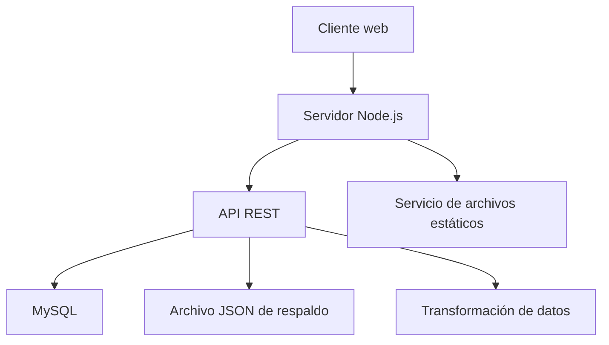
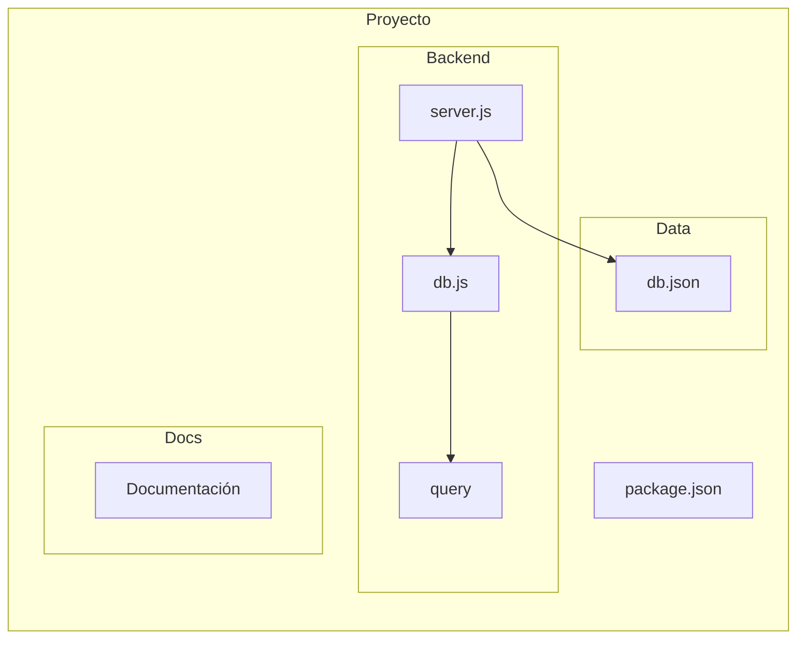
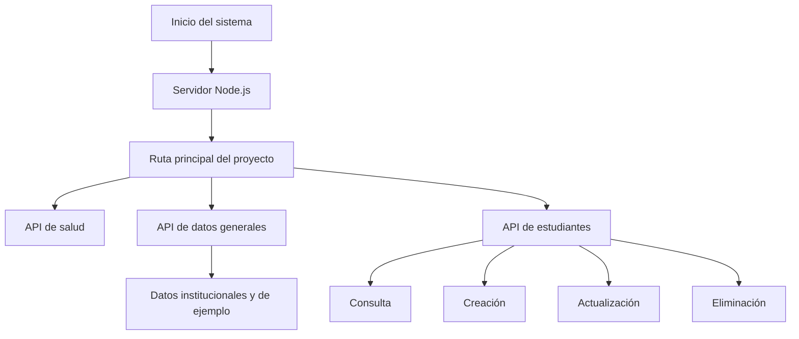

# Documentación Técnica Consolidada PIAR

## Información general

Este documento reúne la documentación técnica generada para el proyecto PIAR en un único archivo Markdown, listo para copiar, descargar o convertir posteriormente a Word.

La información contenida aquí se basa exclusivamente en la implementación real del repositorio actual, sin agregar funcionalidades no presentes en el código.

---

## Índice

1. Requerimientos del sistema
2. Arquitectura
3. Capas de la aplicación
4. Seguridad
5. Codificación de módulos
6. Librerías y Frameworks
7. Control de versiones
8. Pruebas unitarias y funcionales
9. Configuración del servidor y base de datos
10. Ambientes de desarrollo y pruebas
11. Mapa de navegación

---

# 1. Requerimientos del sistema

## 1.1 Requerimientos funcionales

### RF-01: Servir contenido estático del proyecto
- El sistema debe entregar archivos estáticos como HTML, CSS, JavaScript y otros recursos desde la raíz del proyecto.
- Evidencia: la función `serveStatic()` en [backend/server.js](backend/server.js).

### RF-02: Exponer una ruta de verificación del servicio
- El sistema debe responder a una solicitud de verificación para confirmar que la API está disponible.
- Evidencia: `GET /api/health` en [backend/server.js](backend/server.js).

### RF-03: Exponer datos del sistema a través de una API
- El sistema debe proporcionar una ruta para consultar datos generales del proyecto.
- Evidencia: `GET /api/data` en [backend/server.js](backend/server.js).

### RF-04: Gestionar estudiantes mediante operaciones CRUD
- El sistema debe permitir consultar, crear, actualizar y eliminar estudiantes.
- Evidencia: rutas `GET`, `POST`, `PUT` y `DELETE` para `/api/estudiantes` en [backend/server.js](backend/server.js).

### RF-05: Adaptar datos de estudiantes al contrato esperado por el frontend
- El sistema transforma los registros obtenidos desde MySQL para responder con un formato más amplio al frontend.
- Evidencia: funciones `getStudentsFromMysql()`, `mapStudentRowToFrontend()` y `normalizeStudentPayload()` en [backend/server.js](backend/server.js).

### RF-06: Permitir reiniciar los datos desde un conjunto base
- El sistema permite restaurar datos iniciales mediante la ruta `POST /api/reset`.
- Evidencia: [backend/server.js](backend/server.js).

### RF-07: Soportar solicitudes preflight para CORS
- El sistema responde a solicitudes `OPTIONS` para habilitar el uso de la API desde clientes web.
- Evidencia: [backend/server.js](backend/server.js).

## 1.2 Requerimientos no funcionales

### RNF-01: Puerto configurable del servidor
- El servidor puede iniciarse en un puerto configurable mediante `process.env.PORT`.
- Evidencia: [backend/server.js](backend/server.js).

### RNF-02: Uso de base de datos relacional
- El sistema requiere MySQL para operar sobre los datos de estudiantes.
- Evidencia: [backend/db.js](backend/db.js).

### RNF-03: Respuesta JSON para la API
- Las respuestas de la API se entregan en formato JSON.
- Evidencia: función `sendJson()` en [backend/server.js](backend/server.js).

### RNF-04: Manejo explícito de errores HTTP
- El servidor responde con códigos de estado claros como 200, 201, 404 y 500.
- Evidencia: [backend/server.js](backend/server.js).

### RNF-05: Validación básica de rutas estáticas
- El servidor evita que las rutas estáticas salgan fuera del directorio del proyecto.
- Evidencia: [backend/server.js](backend/server.js).

---

# 2. Arquitectura

## 2.1 Arquitectura general

El proyecto tiene una arquitectura simple basada en un servidor HTTP local desarrollado con Node.js. Su función principal es servir recursos estáticos y exponer una API ligera para gestionar información de estudiantes y datos de apoyo.

## 2.2 Arquitectura por capas

### Capa de presentación
- Responsabilidad: recibir solicitudes del cliente y entregar respuestas.
- Archivos: [backend/server.js](backend/server.js), [README.md](README.md).

### Capa de negocio
- Responsabilidad: transformar y adaptar datos para que el frontend y la base de datos los comprendan.
- Archivos: [backend/server.js](backend/server.js).

### Capa de acceso a datos
- Responsabilidad: interactuar con MySQL y con el archivo JSON de respaldo.
- Archivos: [backend/db.js](backend/db.js), [backend/server.js](backend/server.js), [data/db.json](data/db.json).

## 2.3 Diagrama de componentes

## 2.4 Diagrama de paquetes

## 2.5 Diagrama de clases

No aplica de manera explícita. El proyecto no define clases en JavaScript orientado a objetos. La lógica está organizada en funciones dentro de [backend/server.js](backend/server.js).

---

# 3. Capas de la aplicación

## 3.1 Capa de presentación
- Responsabilidad: atender peticiones HTTP y entregar recursos al cliente.
- Archivos: [backend/server.js](backend/server.js).
- Flujo: solicitud → evaluación de ruta → respuesta estática o JSON.
- Dependencias: módulos nativos de Node.js.

## 3.2 Capa de negocio
- Responsabilidad: adaptar y transformar la información de estudiantes.
- Archivos: [backend/server.js](backend/server.js).
- Flujo: recibir payload o consulta → normalizar o transformar → responder o persistir.
- Dependencias: conexión a MySQL y datos de respaldo.

## 3.3 Capa de acceso a datos
- Responsabilidad: interactuar con MySQL y con el archivo JSON.
- Archivos: [backend/db.js](backend/db.js), [backend/server.js](backend/server.js), [data/db.json](data/db.json).
- Flujo: conexión → ejecución de SQL o lectura/escritura de archivo → respuesta al backend.
- Dependencias: `mysql2` y módulos de sistema.

---

# 4. Seguridad

## 4.1 Autenticación
- No existe un sistema de autenticación real implementado en el backend.
- Evidencia: no hay login, tokens ni validación de sesiones en [backend/server.js](backend/server.js).

## 4.2 Autorización
- No existe control de acceso por roles ni permisos por ruta.
- Todas las rutas API están expuestas al cliente.

## 4.3 Validaciones
- Se realiza una validación básica de la ruta estática y del cuerpo JSON.
- No existen validaciones profundas de campos obligatorios ni de tipos de datos.

## 4.4 Protección de datos
- La conexión a MySQL usa credenciales explícitas en [backend/db.js](backend/db.js).
- El archivo [data/db.json](data/db.json) contiene datos de ejemplo con información personal.

## 4.5 Riesgos actuales
- Credenciales de MySQL visibles en código.
- Falta de autenticación y autorización.
- Validaciones débiles.
- Exposición de datos de ejemplo.

## 4.6 Recomendaciones
- Externalizar credenciales a variables de entorno.
- Implementar autenticación básica.
- Definir autorización por roles.
- Fortalecer validaciones.
- Usar datos de prueba anonimizados.

---

# 5. Codificación de módulos

## 5.1 Módulo principal: servidor HTTP

### Objetivo
Atender peticiones HTTP, entregar recursos estáticos y procesar la API.

### Funciones principales
- `handleApi(request, response, url)`
- `serveStatic(response, pathname)`
- `readDbFromMysql()`
- `getStudentsFromMysql(callback)`
- `mapStudentRowToFrontend(row)`
- `normalizeStudentPayload(payload)`
- `splitStudentName(nombre)`
- `sendJson(response, status, data)`
- `readJsonBody(request)`

### Explicación
- `handleApi()` procesa todas las solicitudes bajo `/api`.
- `serveStatic()` entrega archivos desde la raíz del proyecto.
- `readDbFromMysql()` arma la respuesta de `/api/data`.
- `getStudentsFromMysql()` consulta estudiantes desde MySQL.
- `mapStudentRowToFrontend()` adapta los datos al contrato esperado por la SPA.
- `normalizeStudentPayload()` permite aceptar distintos nombres de campos.
- `splitStudentName()` divide temporalmente el nombre para construir `nombres` y `apellidos`.

## 5.2 Módulo de conexión a base de datos
- Objetivo: establecer la conexión con MySQL.
- Archivo: [backend/db.js](backend/db.js).
- Función principal: crear una conexión con `mysql2` y ejecutar consultas SQL.

## 5.3 Módulo de persistencia JSON
- Objetivo: leer y escribir un archivo JSON como respaldo o datos base.
- Archivos: [backend/server.js](backend/server.js), [data/db.json](data/db.json).
- Funciones: `readDb()`, `writeDb(data)`, `readSeedData()`.

## 5.4 Buenas prácticas observadas
- Separación de responsabilidades en funciones pequeñas.
- Centralización del envío de respuestas JSON.
- Manejo de errores en bloques `try/catch` y callbacks.

## 5.5 Patrones de diseño encontrados
- Patrón de función de servicio.
- Transformación de datos.
- Persistencia simple basada en archivo.

---

# 6. Librerías y Frameworks

| Librería / Framework | Versión | Para qué sirve | Dónde se utiliza | Justificación técnica |
|---|---:|---|---|---|
| Node.js | No declarada | Ejecutar el servidor HTTP y los scripts del backend | [backend/server.js](backend/server.js) | Entorno base del proyecto |
| mysql2 | ^3.22.5 | Conectar y consultar MySQL | [backend/db.js](backend/db.js), [backend/server.js](backend/server.js) | Permite ejecutar consultas SQL |
| http | Incluido en Node.js | Crear el servidor HTTP | [backend/server.js](backend/server.js) | Base del backend actual |
| fs/promises | Incluido en Node.js | Leer y escribir archivos | [backend/server.js](backend/server.js) | Manejo asíncrono de archivos |
| path | Incluido en Node.js | Resolver rutas | [backend/server.js](backend/server.js) | Construcción de rutas seguras |
| vm | Incluido en Node.js | Ejecutar código JavaScript desde texto | [backend/server.js](backend/server.js) | Interpretar datos base del proyecto |

---

# 7. Control de versiones

## 7.1 Sistema utilizado
- El proyecto usa Git.
- Rama actual: `main`.

## 7.2 Commits relevantes
- `0709366` - `Configuracion inicial backend`
- `fcd8c85` - `Primer commit backend PIAR`

## 7.3 Flujo de trabajo observado
- Trabajo directo sobre la rama `main`.
- Cambios pendientes en [backend/server.js](backend/server.js), [backend/db.js](backend/db.js) y documentos nuevos en [docs](docs).

## 7.4 Organización del repositorio
- [backend](backend): servidor y lógica del backend.
- [data](data): datos de respaldo o prueba.
- [docs](docs): documentación técnica.
- [package.json](package.json): dependencias.
- [README.md](README.md): instrucciones de uso.

## 7.5 Capturas recomendadas
- `git status`
- `git branch --show-current`
- `git log --oneline --decorate -10`

---

# 8. Pruebas unitarias y funcionales

## 8.1 Pruebas realizadas

| Aspecto | Detalle | Resultado |
|---|---|---|
| Sintaxis del backend | `node --check backend/server.js` | Exitoso |
| Ruta de salud | `GET /api/health` | Implementada |
| Consulta de estudiantes | `GET /api/estudiantes` | Implementada |
| Datos generales | `GET /api/data` | Implementada |
| Creación y actualización | `POST/PUT /api/estudiantes` | Implementadas |
| Eliminación | `DELETE /api/estudiantes/:id` | Implementada |

## 8.2 Casos de prueba identificados

| Caso | Entrada | Resultado esperado | Estado |
|---|---|---|---|
| CT-01 | Solicitud a `/api/health` | Respuesta JSON con `ok: true` | Implementado |
| CT-02 | Solicitud a `/api/estudiantes` | Lista de estudiantes transformada | Implementado |
| CT-03 | Solicitud a `/api/data` | Objeto estructurado con datos generales | Implementado |
| CT-04 | Payload de creación | Inserción en MySQL | Implementado |
| CT-05 | Payload de actualización | Actualización de estudiante | Implementado |
| CT-06 | ID de eliminación | Eliminación del registro | Implementado |

## 8.3 Evidencias recomendadas
- Captura de la salida de `node --check backend/server.js`.
- Capturas del código de [backend/server.js](backend/server.js).
- Capturas de [backend/db.js](backend/db.js) y [data/db.json](data/db.json).

---

# 9. Configuración del servidor y base de datos

## 9.1 Node.js
- El backend se ejecuta con Node.js.
- Ejecución según [README.md](README.md): `node backend/server.js`.

## 9.2 MySQL
- Motor de base de datos principal.
- Configuración identificada:
  - Host: `127.0.0.1`
  - Usuario: `root`
  - Contraseña: `123456`
  - Base de datos: `piar`
  - Puerto: `3306`

## 9.3 Configuración del backend
- Puerto: `8080`.
- Definición: `const PORT = Number(process.env.PORT || 8080);`.
- URL de ejecución: `http://localhost:8080`.

## 9.4 API expuesta
| Ruta | Método | Función |
|---|---|---|
| `/api/health` | GET | Verificar disponibilidad |
| `/api/data` | GET | Entregar datos generales |
| `/api/estudiantes` | GET | Consultar estudiantes |
| `/api/estudiantes` | POST | Crear estudiante |
| `/api/estudiantes/:id` | PUT | Actualizar estudiante |
| `/api/estudiantes/:id` | DELETE | Eliminar estudiante |
| `/api/reset` | POST | Restaurar datos base |

## 9.5 Variables utilizadas
- `PORT`
- `ROOT`
- `DB_PATH`

## 9.6 Capturas recomendadas
- Captura de [backend/server.js](backend/server.js).
- Captura de [backend/db.js](backend/db.js).
- Captura de [README.md](README.md).
- Captura de [data/db.json](data/db.json).

---

# 10. Ambientes de desarrollo y pruebas

## 10.1 Sistema operativo
- El entorno de trabajo actual corresponde a Windows.

## 10.2 Visual Studio Code
- El proyecto se desarrolla en VS Code.

## 10.3 Node.js
- Se usa para ejecutar el backend del proyecto.

## 10.4 MySQL
- Requerido para operaciones reales sobre la tabla `estudiante`.

## 10.5 Navegador
- Se usa un navegador web para acceder a la aplicación y a los recursos del servidor.

## 10.6 Live Server
- No se evidencia su uso en el código real del repositorio.

## 10.7 Herramientas utilizadas
- VS Code
- Node.js
- MySQL
- PowerShell
- Git

---

# 11. Mapa de navegación

## 11.1 Alcance
El proyecto no expone un conjunto completo de pantallas tipo Login → Menú → Reportes. Lo que sí está implementado es un flujo de acceso a un servidor local y a una API de servicios.

## 11.2 Flujo general

## 11.3 Módulos o pantallas identificables
- Pantalla inicial o acceso principal: servidor que entrega recursos desde la raíz.
- API de salud.
- API de datos generales.
- Gestión de estudiantes.
- Datos base o respaldo.

## 11.4 Archivos que implementan el flujo
- [backend/server.js](backend/server.js)
- [backend/db.js](backend/db.js)
- [data/db.json](data/db.json)
- [README.md](README.md)

## 11.5 Limitaciones reales
No se evidencian pantallas completas de login, menú, docentes, observaciones o reportes en el repositorio actual.

---

## Cierre

La documentación anterior fue elaborada con base en los archivos reales del proyecto PIAR y puede servir como insumo base para una versión profesional en Word o PDF.
